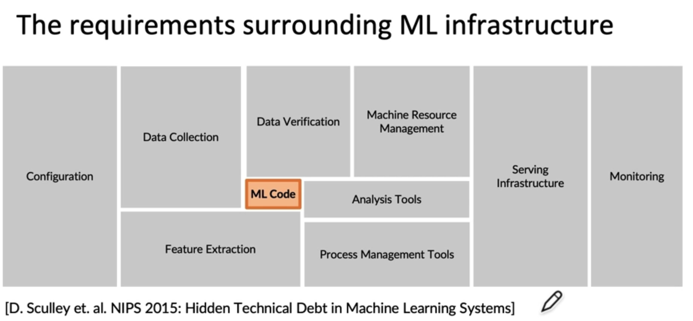

# Machine Learning Interview

## Question:
1. How do you deploy and monitor machine learning model in production
  
## Machine Learning Lifecycle
1. Scope your project
2. define your data
3. training model
4. determine and implement best deployment pattern for your application

## Issue might happen in Production
1. Concept Drift / Data Drift: Real production condision are not the same as training and holdout testing environment 
2. More than just machine leanring code: only 5%
